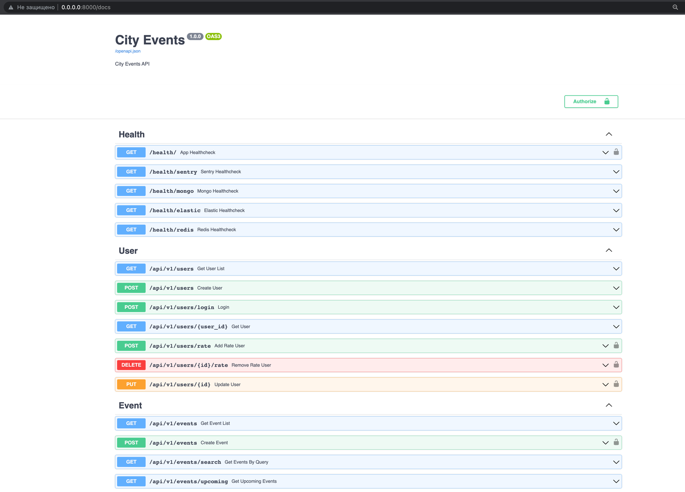
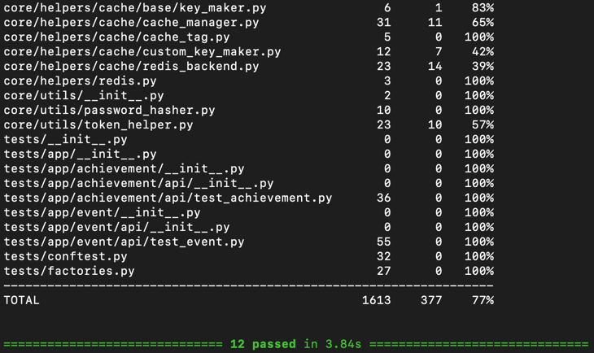

# About the project

The backend city tracking service is designed to provide users with the ability to keep abreast of various events taking
place in their city.

The purpose of this service is to simplify the process of finding and registering a person for an event, as well as
providing a convenient tool for event organizers to manage their events.

The main features of this service are:

* Search for the closest events according to your geo-location.
* Full-text event search allows you to find any event you are interested in by keywords.
* Online chat with the participants of the event, implemented on the technology of web sockets.

# Project Stack

* **FastApi** – a web framework for creating APIs written in Python. One of the fastest and most popular web frameworks
  written in Python.
* **Async SqlAlchemy 2.0** – an asynchronous object-relational mapper that gives application developers the full power
  and
  flexibility of SQL.
* **Alembic** – a database migration tool for SQLAlchemy.
* **PostgreSQL** – a powerful open source object-relational database system.
* **PostGis** – an open source software that adds support for geographic features to the PostgreSQL relational database.
  Necessary technology for implementing search by coordinates in a project.
* **Mongo DB** – a document-oriented database management system that does not require a description of the table schema.
  Used as a document-oriented storage for storing chat messages.
* **Redis** – an open source, self-hosted NoSQL database management system that works with key-value data structures.
  Used as in-memory storage of cache.
* **RabbitMq** – a software message broker based on the AMQP standard.
  Used as a message broker for celery.
* **ElasticSearch** – a copyable software search engine, as of the mid-2010s, the most popular in its category.
  Necessary project dependency to implement full-text search for events.
* **WebSockets** – a communication protocol over a TCP connection designed to exchange messages between a browser and a
  web
  server using a persistent connection.
  The protocol used for duplex communication to implement a real-time chat event.
* **Celery** – an open source asynchronous task queue or job queue based on distributed message passing.
  Necessary project dependency to create asynchronous background tasks.
* **Sentry** – a bug tracking and performance monitoring platform developed primarily by developers.

# Installation and launch

**Installation**

You can clone this application:

```bash 
git clone https://github.com/Blastz13/city_events
```

You need to define environment variables in the **.env** file to run the application in docker.
An example file with environment variables is located in the **.env.example** file.

Next, you need to run the project using docker from the root directory:

```bash
docker-compose -f ./docker/docker-compose.yml up -d --build
```

# Manual Launch

You can clone this application:

```bash 
git clone https://github.com/Blastz13/city_events
```

You need to define environment variables in the **.env** file to run the application.
An example file with environment variables is located in the **.env.example** file.

Next, you need to install the necessary libraries:

### Poetry

```bash
poetry install
poetry update
poetry shell
```

### Pip

```bash
pip3 install -r requirements.txt
```

## Generating and applying database migrations

```bash
alembic revision --autogenerate -m '<comment>'
alembic upgrade head
```

Now you can start the server:

```bash
uvicorn app.server:app --host 0.0.0.0 --port 8000 --reload
```

OR

```bash
python3 main.py --env test|local|dev|prod --debug
```

## Launching celery

Celery Worker

```bash
 celery -A celery_app.celery_app worker --loglevel=info
```

Celery Beat

```bash
celery -A celery_app.celery_app beat --loglevel=info
```

## Swagger

Swagger is located at the following address: http://0.0.0.0:8000/docs


## Running tests

```bash
pytest -s -p no:warnings --cov
```



### License

Copyright © 2023 [Blastz13](https://github.com/Blastz13/).